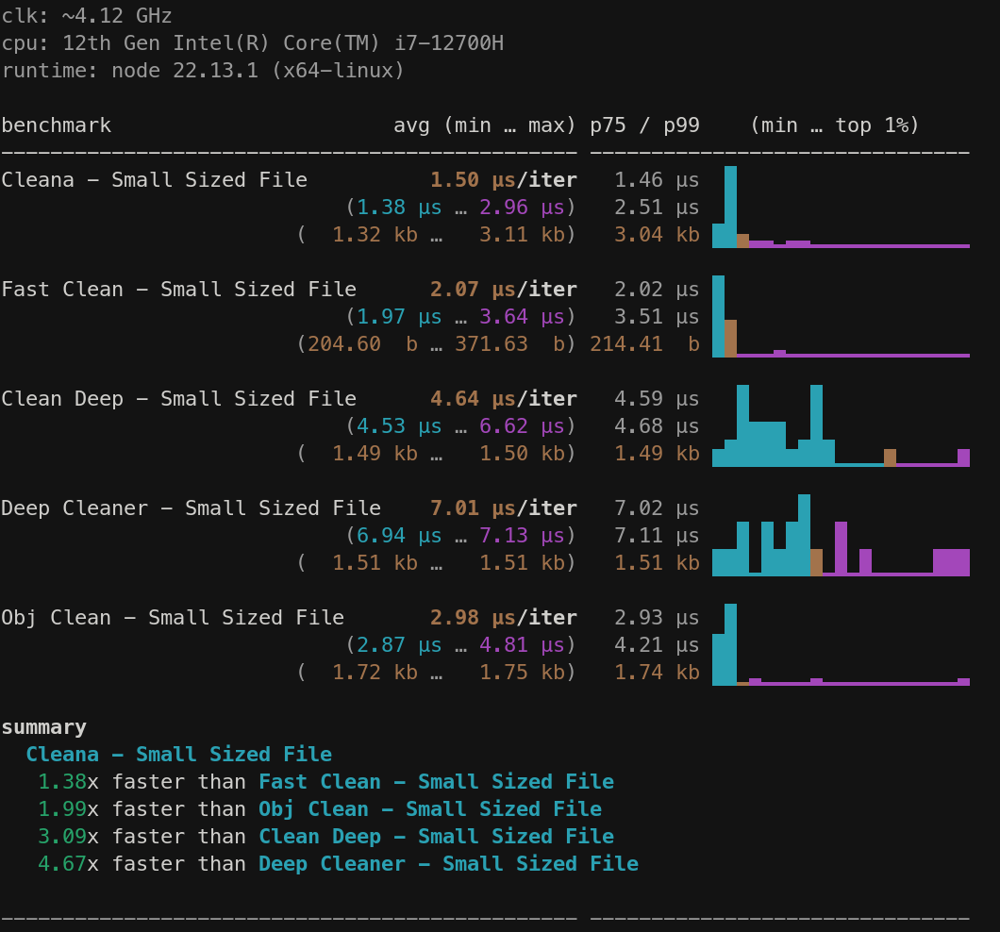

# 🧼 Cleana

Clean JavaScript Objects and Arrays, recursively. Lightweight and Fast.

[](https://npmjs.com/package/cleana)
[](https://npm.chart.dev/cleana)

A fast, lightweight utility for recursively cleaning JavaScript objects and arrays by removing unwanted values like `undefined`, `null`, `NaN`, empty strings, empty objects, and empty arrays.

## Installation

```sh
# npm
npm install cleana

# pnpm
pnpm add cleana

# bun
bun add cleana
```

## Quick Start

```ts
import { cleana } from "cleana"

const input = {
	array: [],
	object: {},
	string: "",
	nan: Number.NaN,
	und: undefined,
	value: "123",
	nested: {
		arr: ["", [], {}],
		obj: { key: {}, key2: [] },
		nestedValue: "456"
	}
}

cleana(input)
// => { value: "123", nested: { nestedValue: "456" } }
```

## Features

- **Recursive cleaning** - Traverses nested objects and arrays
- **Structural sharing** - Unchanged subtrees reuse original references for memory efficiency
- **Circular reference handling** - Optional detection and removal of circular references
- **In-place mutation** - Option to mutate the original object instead of creating a copy
- **Selective cleaning** - Fine-grained control over what gets removed
- **Zero dependencies** - Lightweight (~1KB gzipped) with 100% test coverage

## API

```ts
function cleana<T>(data: T, options?: CleanaOptions): Cleaned<T>
```

### Options

| Option | Type | Default | Description |
|--------|------|---------|-------------|
| `cleanNull` | `boolean` | `true` | Remove `null` values |
| `cleanUndefined` | `boolean` | `true` | Remove `undefined` values |
| `cleanString` | `boolean` | `true` | Remove empty strings `""` |
| `cleanNaN` | `boolean` | `true` | Remove `NaN` values |
| `cleanArray` | `boolean` | `true` | Remove empty arrays `[]` |
| `cleanObject` | `boolean` | `true` | Remove empty objects `{}` |
| `removeKeys` | `string[]` | `[]` | Remove properties by key name (at all nesting levels) |
| `removeValues` | `any[]` | `[]` | Remove properties by value (supports deep equality) |
| `inPlace` | `boolean` | `false` | Mutate the input instead of creating a new object |
| `circularReference` | `boolean` | `false` | Detect and remove circular references |

## Examples

### Preserve specific empty values

```ts
// Keep null values
cleana({ a: null, b: "", c: 42 }, { cleanNull: false })
// => { a: null, c: 42 }

// Keep empty strings
cleana({ a: "", b: null, c: 42 }, { cleanString: false })
// => { a: "", c: 42 }

// Keep empty arrays and objects
cleana({ a: [], b: {}, c: 42 }, { cleanArray: false, cleanObject: false })
// => { a: [], b: {}, c: 42 }
```

### Remove specific keys

Remove properties by key name across all nesting levels:

```ts
const input = {
	id: 1,
	password: "secret",
	user: {
		name: "John",
		password: "hidden"
	}
}

cleana(input, { removeKeys: ["password"] })
// => { id: 1, user: { name: "John" } }
```

### Remove specific values

Remove properties by value using deep equality comparison:

```ts
const input = {
	a: 1,
	b: 2,
	c: { x: 1 },
	d: { x: 2 }
}

cleana(input, { removeValues: [1, { x: 1 }] })
// => { b: 2, d: { x: 2 } }
```

### In-place mutation

Mutate the original object instead of creating a copy:

```ts
const input = { a: null, b: "", c: 42 }
cleana(input, { inPlace: true })

console.log(input)
// => { c: 42 }
```

### Circular reference handling

Handle objects with circular references safely:

```ts
const obj: any = { a: 1, nested: { b: 2 } }
obj.self = obj
obj.nested.parent = obj

// Without circularReference option, this would cause issues
// With the option enabled, circular refs are removed
cleana(obj, { circularReference: true })
// => { a: 1, nested: { b: 2 } }
```

> **Note:** Circular reference detection uses a `WeakSet` internally. Enable only when needed as it adds a small overhead.

## Performance

Cleana is optimized for speed through:

- **Bitfield flags** - Options compiled into a single bitfield for fast boolean checks
- **Lazy allocation** - Output objects/arrays created only when changes are detected
- **Structural sharing** - Unchanged branches reuse original references
- **Zero allocations on default path** - Pre-computed config for option-less calls

Cleana is built on the work of [`fast-clean`](https://github.com/Youssef93/fast-clean), [`clean-deep`](https://github.com/nunofgs/clean-deep). [`deep-cleaner`](https://github.com/darksinge/deep-cleaner) and [`obj-clean`](https://www.npmjs.com/package/obj-clean).

**Faster and More Efficient**
<br>
Cleana is designed to be quicker than its predecessors.

**All-in-One Features**
<br>
Cleana combines the best functionalities from the libraries mentioned above. This means you get a set of tools for cleaning JavaScript objects all in one place.

**Lightweight and fully tested**
<br>
Cleana has no external dependencies. Its lightweight design helps keep your application running without unnecessary bloat. Cleana is around `1 KB` when Gzipped, and has `100%` test coverage.



Benchmark code is available in the [benchmark directory](https://github.com/Saeid-Za/cleana/tree/main/benchmark).

---
This benchmark runs against the available test cases, It is recommended to benchmark against your data using the benchmark source code.

## Development

```sh
# Clone and install
git clone https://github.com/Saeid-Za/cleana.git
cd cleana
bun install

# Run tests
bun test

# Run tests in watch mode
bun dev

# Run benchmarks
bun run benchmark
```

## License

<!-- automd:contributors license=MIT -->

Published under the [MIT](https://github.com/Saeid-Za/cleana/blob/main/LICENSE) license.
Made by [community](https://github.com/Saeid-Za/cleana/graphs/contributors) 💛
<br><br>
<a href="https://github.com/Saeid-Za/cleana/graphs/contributors">

</a>

<!-- /automd -->
